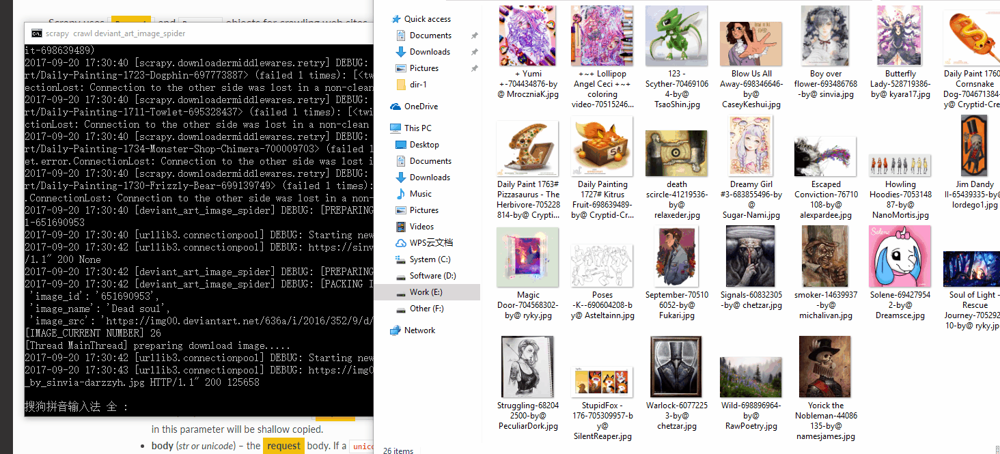

# scrapy-picture-spider

[](https://github.com/ellerbrock/open-source-badge/)


This project is a spider that uses scrapy and beautifulsoup4 for crawl picture.

## Depend Library
This project the depend library have: BeautifulSoup4,Requests,Scarpy,BloomFilter.

So need execute following command:

```
pip install beautifulsoup4
pip install lxml
pip install Scrapy
pip install pybloom-live
pip install requests
```

## Proxies Module
This module for dynamic crawl ip proxy which supply other module use.

### Quick start
You can directly execute the script of name is `proxies_spider.py` also at function `download()` set your download path.

## Deviant_art Module
This module for dynamic crawl image of the https://www.deviantart.com/ and download to your computer.



### Quick start
In the directory of deviant_art_spider execute the following command start this crawler.
```
scrapy crawl deviant_art_image_spider
```

You can setting configuration at `settings.py`.


```
# The attribute is your path for download image
# It default path is current dir
IMAGES_STORE = '.'

# Scrapy close when downloaded image equal to this attribute
MAXIMUM_IMAGE_NUMBER = 10000
```

## Pixiv
This module for dynamic crawl image of the https://www.pixiv.net/ and download to your computer.

### Quick start
You need set your username and password for login pixiv at the settings.py.

```
USERNAME = 'your pixiv username'
PASSWORD = 'your pixiv password'
```

Then in the directory of pixiv_spider execute the following command start this crawler.
```
scrapy crawl pixiv_daily_spider
```